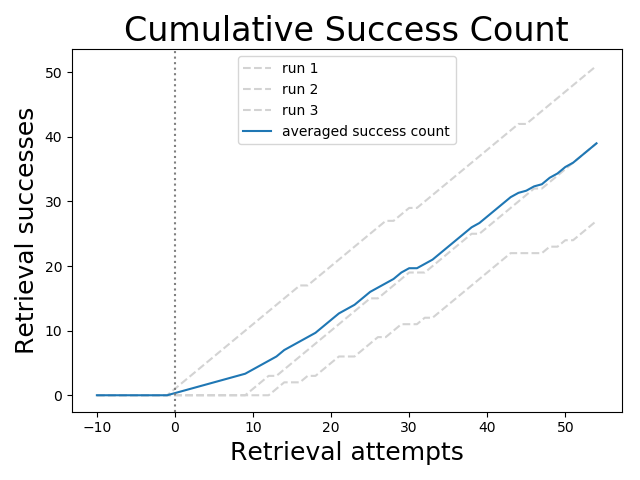

# InteractiveLearningFromDialogue
Data collected during Interactive Learning Experiments.


## Dataset Statistics
### Learning Curve in Composition Learning Experiment


### Dataset in Numbers
```
CONCEPT LEARNING
		 Statistics for: data/concept_learning1a.json
			 total dialogue count 150
			 total turn count 723
			 avg turn count 4.82
			 success rate 0.71
			 dialogues with payout 106


		 Statistics for: data/concept_learning2a.json
			 total dialogue count 142
			 total turn count 567
			 avg turn count 3.99
			 success rate 0.73
			 dialogues with payout 103


		 Statistics for: data/concept_learning1b.json
			 total dialogue count 113
			 total turn count 238
			 avg turn count 2.11
			 success rate 0.88
			 dialogues with payout 100


		 Statistics for: data/concept_learning2b.json
			 total dialogue count 116
			 total turn count 232
			 avg turn count 2.00
			 success rate 0.89
			 dialogues with payout 104


COMPOSITION LEARNING
		 Statistics for: data/composition_learning0.json
			 total dialogue count 55
			 total turn count 174
			 avg turn count 3.16
			 dialogues with payout 49
			 teaching dialogue count 0
			 teaching turn count 0
			 teaching avg turn count 0.00
			 teaching success rate 0.00
			 teaching with payout 0
			 retrieving dialogue count 55
			 retrieving turn count 174
			 retrieving avg turn count 3.16
			 retrieving success rate 0.00
			 retrieving with payout 49


		 Statistics for: data/composition_learning1.json
			 total dialogue count 192
			 total turn count 731
			 avg turn count 3.81
			 dialogues with payout 107
			 teaching dialogue count 120
			 teaching turn count 573
			 teaching avg turn count 4.78
			 teaching success rate 0.55
			 teaching with payout 51
			 retrieving dialogue count 72
			 retrieving turn count 158
			 retrieving avg turn count 2.19
			 retrieving success rate 0.57
			 retrieving with payout 56


		 Statistics for: data/composition_learning2.json
			 total dialogue count 150
			 total turn count 578
			 avg turn count 3.85
			 dialogues with payout 104
			 teaching dialogue count 90
			 teaching turn count 441
			 teaching avg turn count 4.90
			 teaching success rate 0.79
			 teaching with payout 50
			 retrieving dialogue count 60
			 retrieving turn count 137
			 retrieving avg turn count 2.28
			 retrieving success rate 0.72
			 retrieving with payout 54


		 Statistics for: data/composition_learning3.json
			 total dialogue count 150
			 total turn count 492
			 avg turn count 3.28
			 dialogues with payout 102
			 teaching dialogue count 95
			 teaching turn count 394
			 teaching avg turn count 4.15
			 teaching success rate 0.67
			 teaching with payout 50
			 retrieving dialogue count 55
			 retrieving turn count 98
			 retrieving avg turn count 1.78
			 retrieving success rate 0.93
			 retrieving with payout 52


GLOBAL TOTAL DIALOGUE COUNT: 1068
GLOBAL MANUALLY CORRECTED DIALOGUE ANNOTATIONS: 85

COMPOSITION LEARNING PROGRESS
	Plotting composition learning progress
			 progress (len: 72) data/composition_learning1.json
				 [0, 0, 0, 0, 0, 0, 0, 0, 0, 0, 0, 0, 0, 1, 2, 2, 2, 3, 3, 4, 5, 6, 6, 6, 7, 8, 9, 9, 10, 11, 11, 11, 12, 12, 13, 14, 15, 16, 17, 18, 19, 20, 21, 22, 22, 22, 22, 22, 23, 23, 24, 24, 25, 26, 27, 28, 28, 29, 30, 31, 32, 33, 34, 35, 36, 37, 38, 39, 40, 40, 40, 41]
			 progress (len: 60) data/composition_learning2.json
				 [0, 0, 0, 0, 0, 0, 0, 0, 0, 0, 1, 2, 3, 3, 4, 5, 6, 7, 8, 9, 10, 11, 12, 13, 14, 15, 15, 16, 17, 18, 19, 19, 19, 20, 21, 22, 23, 24, 25, 25, 26, 27, 28, 29, 30, 31, 32, 32, 33, 34, 35, 36, 37, 38, 39, 40, 41, 42, 43, 43]
			 progress (len: 55) data/composition_learning3.json
				 [1, 2, 3, 4, 5, 6, 7, 8, 9, 10, 11, 12, 13, 14, 15, 16, 17, 17, 18, 19, 20, 21, 22, 23, 24, 25, 26, 27, 27, 28, 29, 29, 30, 31, 32, 33, 34, 35, 36, 37, 38, 39, 40, 41, 42, 42, 43, 44, 45, 46, 47, 48, 49, 50, 51]
			 averaged progress (len: 55)
				 [0.3333333333333333, 0.6666666666666666, 1.0, 1.3333333333333333, 1.6666666666666667, 2.0, 2.3333333333333335, 2.6666666666666665, 3.0, 3.3333333333333335, 4.0, 4.666666666666667, 5.333333333333333, 6.0, 7.0, 7.666666666666667, 8.333333333333334, 9.0, 9.666666666666666, 10.666666666666666, 11.666666666666666, 12.666666666666666, 13.333333333333334, 14.0, 15.0, 16.0, 16.666666666666668, 17.333333333333332, 18.0, 19.0, 19.666666666666668, 19.666666666666668, 20.333333333333332, 21.0, 22.0, 23.0, 24.0, 25.0, 26.0, 26.666666666666668, 27.666666666666668, 28.666666666666668, 29.666666666666668, 30.666666666666668, 31.333333333333332, 31.666666666666668, 32.333333333333336, 32.666666666666664, 33.666666666666664, 34.333333333333336, 35.333333333333336, 36.0, 37.0, 38.0, 39.0]
```

